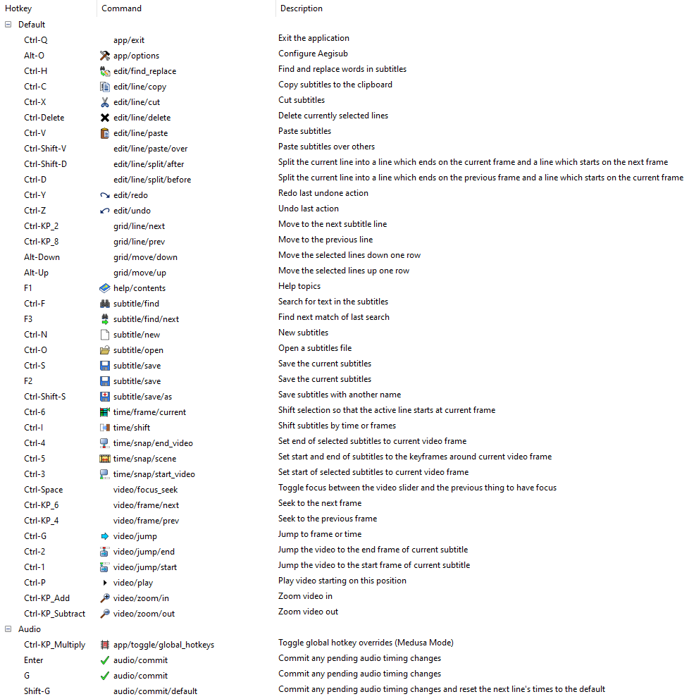
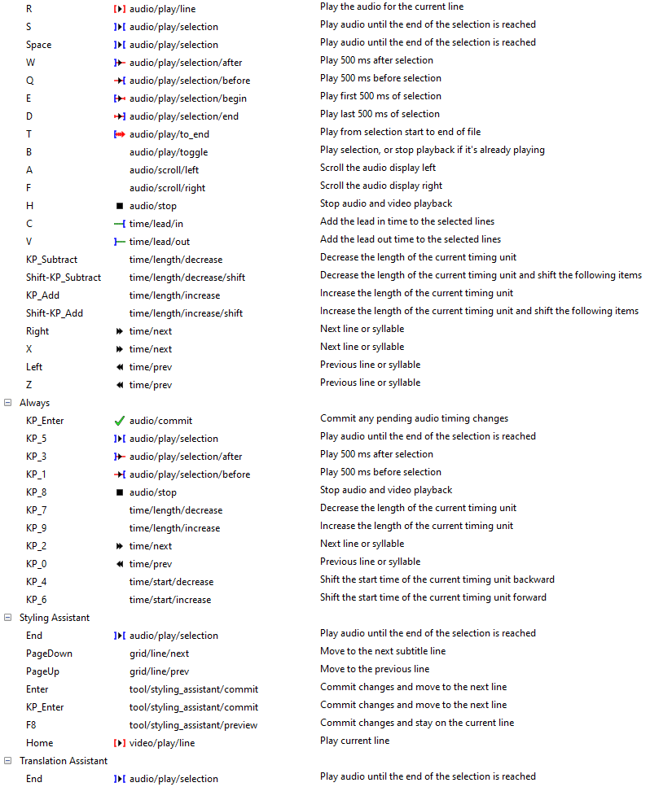
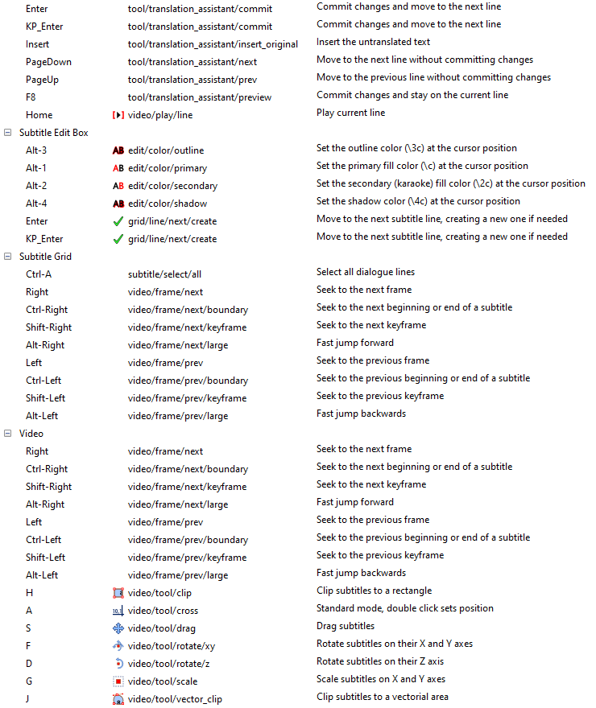

Aegisub keyboard shortcuts based on Aegisub 3.2.2, grabbed with a screenshot to text grabber, so might have mistakes.

Screenshot to text grab

| Category              | Hotkey            | Command                                    | Description                                                                                                      |
| --------------------- | ----------------- | ------------------------------------------ | ---------------------------------------------------------------------------------------------------------------- |
|                       |                   |                                            |                                                                                                                  |
| Default               | Ctrl-Q            | app/exit                                   | Exit the application                                                                                             |
| Default               | Alt-0             | app/options                                | Configure Aegisub                                                                                                |
| Default               | Ctrl-H            | edit/find_replace                          | Find and replace words in subtitles                                                                              |
| Default               | Ctrl-C            | edit/line/copy                             | Copy subtitles to the clipboard                                                                                  |
| Default               | Ctrl-X            | edit/line/cut                              | Cut subtitles                                                                                                    |
| Default               | Ctrl-Delete       | edit/line/delete                           | Delete currently selected lines                                                                                  |
| Default               | Ctrl-V            | edit/line/paste                            | Paste subtitles                                                                                                  |
| Default               | Ctrl-Shift-V      | edit/line/paste/over                       | Paste subtitles over others                                                                                      |
| Default               | Ctrl-Shift-D      | edit/line/split/after                      | Split the current line into a line which ends on the current frame and a line which starts on the next frame     |
| Default               | Ctrl-D            | edit/line/split/before                     | Split the current line into a line which ends on the previous frame and a line which starts on the current frame |
| Default               | Ctrl-Y            | edit/redo                                  | Redo last undone action                                                                                          |
| Default               | Ctrl-Z            | edit/undo                                  | Undo last action                                                                                                 |
| Default               | Ctrl-KP_2         | grid/line/next                             | Move to the next subtitle line                                                                                   |
| Default               | Ctrl-KP_8         | grid/line/prev                             | Move to the previous line                                                                                        |
| Default               | Alt-Down          | grid/move/down                             | Move the selected lines down one row                                                                             |
| Default               | Alt-Up            | grid/move/up                               | Move the selected lines up one row                                                                               |
| Default               | F1                | help/contents                              | Help topics                                                                                                      |
| Default               | Ctrl-F            | subtitle/find                              | Search for text in the subtitles                                                                                 |
| Default               | F3                | subtitle/find/next                         | Find next match of last search                                                                                   |
| Default               | Ctrl-N            | subtitle/new                               | New subtitles                                                                                                    |
| Default               | Ctrl-0            | subtitle/open                              | Open a subtitles file                                                                                            |
| Default               | Ctrl-S            | subtitle/save                              | Save the current subtitles                                                                                       |
| Default               | F2                | subtitle/save                              | Save the current subtitles                                                                                       |
| Default               | Ctrl-Shift-S      | subtitle/save/as                           | Save subtitles with another name                                                                                 |
| Default               | Ctrl-6            | time/frame/current                         | Shift selection so that the active line starts at current frame                                                  |
| Default               | Ctrl-I            | time/shift                                 | Shift subtitles by time or frames                                                                                |
| Default               | Ctrl-4            | time/snap/end_video                        | Set end of selected subtitles to current video frame                                                             |
| Default               | Ctrl-5            | time/snap/scene                            | Set start and end of subtitles to the keyframes around current video frame                                       |
| Default               | Ctrl-3            | time/snap/start_video                      | Set start of selected subtitles to current video frame                                                           |
| Default               | Ctrl-Space        | video/focus_seek                           | Toggle focus between the video slider and the previous thing to have focus                                       |
| Default               | Ctrl-KP_6         | video/frame/next                           | Seek to the next frame                                                                                           |
| Default               | Ctrl-KP_4         | video/frame/prev                           | Seek to the previous frame                                                                                       |
| Default               | Ctrl-G            | video/jump                                 | Jump to frame or time                                                                                            |
| Default               | Ctrl-2            | video/jump/end                             | Jump the video to the end frame of current subtitle                                                              |
| Default               | Ctrl-1            | video/jump/start                           | Jump the video to the start frame of current subtitle                                                            |
| Default               | Ctrl-P            | video/play                                 | Play video starting on this position                                                                             |
| Default               | Ctrl-KP_Add       | video/zoom/in                              | Zoom video in                                                                                                    |
| Default               | Ctrl-KP_Subtract  | video/zoom/out                             | Zoom video out                                                                                                   |
|                       |                   |                                            |                                                                                                                  |
| Audio                 | Ctrl-KP_Multiply  | app/toggle/global_hotkeys                  | Toggle global hotkey overrides (Medusa Mode)                                                                     |
| Audio                 | Enter             | audio/commit                               | Commit any pending audio timing changes                                                                          |
| Audio                 | G                 | audio/commit                               | Commit any pending audio timing changes                                                                          |
| Audio                 | Shift-G           | audio/commit/default                       | Commit any pending audio timing changes and reset the next line's times to the default                           |
| Audio                 | R                 | audio/play/line                            | Play the audio for the current line                                                                              |
| Audio                 | S                 | audio/play/selection                       | Play audio until the end of the selection is reached                                                             |
| Audio                 | Space             | audio/play/selection                       | Play audio until the end of the selection is reached                                                             |
| Audio                 | W                 | audio/play/selection/after                 | Play 500 ms after selection                                                                                      |
| Audio                 | Q                 | audio/play/selection/before                | Play 500 ms before selection                                                                                     |
| Audio                 | E                 | audio/play/selection/begin                 | Play first 500 ms of selection                                                                                   |
| Audio                 | D                 | audio/play/selection/end                   | Play last 500 ms of selection                                                                                    |
| Audio                 | T                 | audio/play/to.end                          | Play from selection start to end of file                                                                         |
| Audio                 | B                 | audio/play/toggle                          | Play selection, or stop playback if it's already playing                                                         |
| Audio                 | A                 | audio/scroll/left                          | Scroll the audio display left                                                                                    |
| Audio                 | F                 | audio/scroll/right                         | Scroll the audio display right                                                                                   |
| Audio                 | H                 | audio/stop                                 | Stop audio and video playback                                                                                    |
| Audio                 | C                 | time/lead/in                               | Add the lead in time to the selected lines                                                                       |
| Audio                 | V                 | time/lead/out                              | Add the lead out time to the selected lines                                                                      |
| Audio                 | KP_Subtract       | time/length/decrease                       | Decrease the length of the current timing unit                                                                   |
| Audio                 | Shift-KP_Subtract | time/length/decrease/shift                 | Decrease the length of the current timing unit and shift the following items                                     |
| Audio                 | KP_Add            | time/length/increase                       | Increase the length of the current timing unit                                                                   |
| Audio                 | Shift-KP_Add      | time/length/increase/shift                 | Increase the length of the current timing unit and shift the following items                                     |
| Audio                 | Right             | time/next                                  | Next line or syllable                                                                                            |
| Audio                 | X                 | time/next                                  | Next line or syllable                                                                                            |
| Audio                 | Left              | time/prev                                  | Previous line or syllable                                                                                        |
| Audio                 | Z                 | time/prev                                  | Previous line or syllable                                                                                        |
|                       |                   |                                            |                                                                                                                  |
| Always                | KP_Enter          | audio/commit                               | Commit any pending audio timing changes                                                                          |
| Always                | KP_5              | audio/play/selection                       | Play audio until the end of the selection is reached                                                             |
| Always                | KP_3              | audio/play/selection/after                 | Play 500 ms after selection                                                                                      |
| Always                | KP_1              | audio/play/selection/before                | Play 500 ms before selection                                                                                     |
| Always                | KP_8              | audio/stop                                 | Stop audio and video playback                                                                                    |
| Always                | KP_7              | time/length/decrease                       | Decrease the length of the current timing unit                                                                   |
| Always                | KP_9              | time/length/increase                       | Increase the length of the current timing unit                                                                   |
| Always                | KP_2              | time/next                                  | Next line or syllable                                                                                            |
| Always                | KP_O              | time/prev                                  | Previous line or syllable                                                                                        |
| Always                | KP_4              | time/start/decrease                        | Shift the start time of the current timing unit backward                                                         |
| Always                | KP_6              | time/start/increase                        | Shift the start time of the current timing unit forward                                                          |
|                       |                   |                                            |                                                                                                                  |
| Styling Assistant     | End               | audio/play/selection                       | Play audio until the end of the selection is reached                                                             |
| Styling Assistant     | PageDown          | grid/line/next                             | Move to the next subtitle line                                                                                   |
| Styling Assistant     | PageUp            | grid/line/prev                             | Move to the previous line                                                                                        |
| Styling Assistant     | Enter             | tool/styling.assistant/commit              | Commit changes and move to the next line                                                                         |
| Styling Assistant     | KP_Enter          | tool/styling.assistant/commit              | Commit changes and move to the next line                                                                         |
| Styling Assistant     | F8                | tool/styling.assistant/preview             | Commit changes and stay on the current line                                                                      |
| Styling Assistant     | Home              | video/play/line                            | Play current line                                                                                                |
|                       |                   |                                            |                                                                                                                  |
| Translation Assistant | End               | audio/play/selection                       | Play audio until the end of the selection is reached                                                             |
| Translation Assistant | Enter             | tool/translation.assistant/commit          | Commit changes and move to the next line                                                                         |
| Translation Assistant | KP_Enter          | tool/translation.assistant/commit          | Commit changes and move to the next line                                                                         |
| Translation Assistant | Insert            | tool/translation.assistant/insert.original | Insert the untranslated text                                                                                     |
| Translation Assistant | PageDown          | tool/translation.assistant/next            | Move to the next line without committing changes                                                                 |
| Translation Assistant | PageUp            | tool/translation.assistant/prev            | Move to the previous line without committing changes                                                             |
| Translation Assistant | F8                | tool/translation.assistant/preview         | Commit changes and stay on the current line                                                                      |
| Translation Assistant | Home              | video/play/line                            | Play current line                                                                                                |
|                       |                   |                                            |                                                                                                                  |
| Subtitle Edit Box     | Alt-3             | ediVcolor/outline                          | Set the outline color (\\3c) at the cursor position                                                              |
| Subtitle Edit Box     | Alt-1             | edit/color/primary                         | Set the primary fill color (\\c) at the cursor position                                                          |
| Subtitle Edit Box     | Alt-2             | edit/color/secondary                       | Set the secondary (karaoke) fill color (\\2c) at the cursor position                                             |
| Subtitle Edit Box     | Alt-4             | edit/color/shadow                          | Set the shadow color (\\4c) at the cursor position                                                               |
| Subtitle Edit Box     | Enter             | grid/line/next/create                     | Move to the next subtitle line, creating a new one if needed                                                     |
| Subtitle Edit Box     | KP_Enter          | grid/line/next/create                      | Move to the next subtitle line, creating a new one if needed                                                     |
|                       |                   |                                            |                                                                                                                  |
| Subtitle Grid         | Ctrl-A            | subtitle/select/all                        | Select all dialogue lines                                                                                        |
| Subtitle Grid         | Right             | video/frame/next                           | Seek to the next frame                                                                                           |
| Subtitle Grid         | Ctrl-Right        | video/frame/next/boundary                  | Seek to the next beginning or end of a subtitle                                                                  |
| Subtitle Grid         | Shift-Right       | video/frame/next/keyframe                  | Seek to the next keyframe                                                                                        |
| Subtitle Grid         | Alt-Right         | video/frame/next/large                     | Fast jump forward                                                                                                |
| Subtitle Grid         | Left              | video/frame/prev                           | Seek to the previous frame                                                                                       |
| Subtitle Grid         | Ctrl-Left         | video/frame/prev/boundary                  | Seek to the previous beginning or end of a subtitle                                                              |
| Subtitle Grid         | Shift-Left        | video/frame/prev/keyframe                  | Seek to the previous keyframe                                                                                    |
| Subtitle Grid         | Alt-Left          | video/frame/prev/large                     | Fast jump backwards                                                                                              |
|                       |                   |                                            |                                                                                                                  |
| Video                 | Right             | video/frame/next                           | Seek to the next frame                                                                                           |
| Video                 | Ctrl-Right        | video/frame/next/boundary                  | Seek to the next beginning or end of a subtitle                                                                  |
| Video                 | Shift-Right       | video/frame/next/keyframe                  | Seek to the next keyframe                                                                                        |
| Video                 | Alt-Right         | video/frame/next/large                     | Fast jump forward                                                                                                |
| Video                 | Left              | video/frame/prev                           | Seek to the previous frame                                                                                       |
| Video                 | Ctrl-Left         | video/frame/prev/boundary                  | Seek to the previous beginning or end of a subtitle                                                              |
| Video                 | Shift-Left        | video/frame/prev/keyframe                  | Seek to the previous keyframe                                                                                    |
| Video                 | Alt-Left          | video/frame/prev/large                     | Fast jump backwards                                                                                              |
| Video                 | H                 | video/tool/clip                            | Clip subtitles to a rectangle                                                                                    |
| Video                 | A                 | video/tool/cross                           | Standard mode, double click sets position                                                                        |
| Video                 | S                 | video/tool/drag                            | Drag subtitles                                                                                                   |
| Video                 | F                 | video/tool/rotate/xy                       | Rotate subtitles on their X and Y axes                                                                           |
| Video                 | D                 | video/tool/rotate/z                        | Rotate subtitles on their Z axis                                                                                 |
| Video                 | G                 | video/tool/scale                           | Scale subtitles on X and Y axes                                                                                  |
| Video                 | J                 | video/tool/vector.clip                     | Clip subtitles to a vectorial area                                                                               |

# Screenshots:

